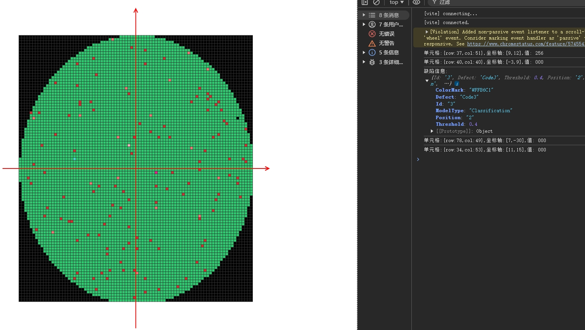

# 数据矩阵转为坐标系呈现方式

一种将数据转为矩阵，然后在web端通过矩阵网格呈现的方式，增加坐标轴获取每个矩阵单元在网格中的位置以及单元格中的位置；

实现方式： js+canvas+vue3

- [x] 矩阵网格
- [x] 坐标轴
- [x] 坐标轴箭头
- [x] 坐标轴网格
- [x] 支持网格点击
- [x] 支持大小缩放
- [x] 支持为网格配置颜色
- [x] 支持画布自适应

